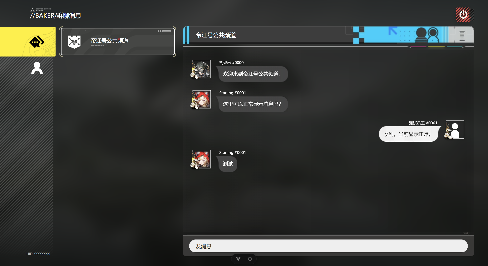

# 仿 Baker 网页聊天工具

**[ WIP | 开发中 ]**

一个界面模仿《明日方舟：终末地》中 Baker 的在线聊天工具。
主要实现浏览器在线聊天功能，类似 Fiora。

目前已完成本地运行单个群聊的 Demo。


TODO: 多个群、私聊、Github企鹅之类的 OAuth、Docker……

## 文件结构

```text
./
    apps/
        web/        # Vue 浏览器端
        server/     # Fastify 服务端
    packages/
        contracts/  # 前后端共享协议
```

## 技术方向

- Vue3、TypeScript、Vite、Pinia
- Fastify、Socket.IO
- PostgreSQL、Drizzle ORM
- pnpm workspace

## 开发环境

- Node.js 24
- pnpm 11.24.0
- PostgreSQL 18

## 本地运行

目前还是早期版本，如果想本地体验可以参考：

1. 开发环境
   你需要有上面提到的开发环境
2. 安装依赖
   ```bash
   pnpm install --frozen-lockfile
   pnpm --filter @baker-chat/contracts build
   ```
3. 数据库
   PostgreSQL 建一个数据库，要求如下
   数据库：`baker_chat_dev`
   所有者：`baker_chat`
4. 环境变量
   `apps/server/.env.example` 是示例，直接复制一个去掉结尾 example，改一下密码就行。
5. 初始化数据
   ```bash
   pnpm --filter @baker-chat/server db:migrate
   pnpm --filter @baker-chat/server db:seed
   ```
6. 测试项目
   开俩终端分别启动一下网页端和服务端
   ```bash
   pnpm --filter @baker-chat/web dev
   pnpm --filter @baker-chat/server dev
   ```
